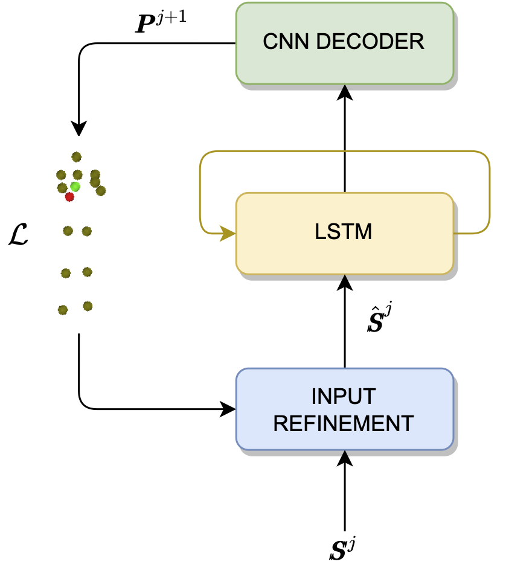

<div id="top"></div>
<!--
*** Thanks for checking out the Best-README-Template. If you have a suggestion
*** that would make this better, please fork the repo and create a pull request
*** or simply open an issue with the tag "enhancement".
*** Don't forget to give the project a star!
*** Thanks again! Now go create something AMAZING! :D
-->


[![Contributors][contributors-shield]][contributors-url]
[![Forks][forks-shield]][forks-url]
[![Stargazers][stars-shield]][stars-url]
[![Issues][issues-shield]][issues-url]
[![MIT License][license-shield]][license-url]
[![LinkedIn][linkedin-shield]][linkedin-url]


<!-- PROJECT LOGO -->
<br />
<div align="center">
<!--
  <a href="https://github.com/matteo-bastico/SkeletonRNN">
    
  </a>-->

<h3 align="center">SkeletonRNN</h3>

  <p align="center">
    SkeletonRNN is a variable length custom Recurrent Deep Neural Network to estimate miss or wrongly detected 3D skeleton joints.  
    <br />
    <a href="https://github.com/matteo-bastico/SkeletonRNN"><strong>Explore the docs »</strong></a>
    <br />
    <br />
    <!--
    <a href="https://github.com/matteo-bastico/SkeletonRNN">View Demo</a>
    · -->
    <a href="https://github.com/matteo-bastico/SkeletonRNN/issues">Report Bug</a>
    ·
    <a href="https://github.com/matteo-bastico/SkeletonRNN/issues">Request Feature</a>
  </p>
</div>

<!-- TABLE OF CONTENTS -->
<details>
  <summary>Table of Contents</summary>
  <ol>
    <li>
      <a href="#about-the-project">About The Project</a>
      <ul>
        <li><a href="#citation">Citation</a></li>
        <li><a href="#built-with">Built With</a></li>
      </ul>
    </li>
    <li>
      <a href="#getting-started">Getting Started</a>
      <ul>
        <li><a href="#prerequisites">Prerequisites</a></li>
        <li><a href="#installation">Installation</a></li>
      </ul>
    </li>
    <li><a href="#usage">Usage</a>
      <ul>
        <li><a href="#dataset">Dataset</a></li>
        <li><a href="#training">Training</a></li>
        <li><a href="#testing">Testing</a></li>
      </ul>
    </li>
    <li><a href="#roadmap">Roadmap</a></li>
    <li><a href="#contributing">Contributing</a></li>
    <li><a href="#license">License</a></li>
    <li><a href="#contact">Contact</a></li>
    <li><a href="#acknowledgments">Acknowledgments</a></li>
  </ol>
</details>

<!-- ABOUT THE PROJECT -->
## About The Project
The extraction of 2D or 3D skeletons from images
is a well-known procedure to perform data anonymization. 
The skeleton estimation has been shown to be sometimes 
disordered or not available and can provide wrong human 
identification. Indeed, many points are likely to miss 
causing issues in related tasks. 
We present here the Deep Learning architecture proposed in ["Continuous Person Identification and Tracking in Healthcare by Integrating Accelerometer Data and Deep Learning Filled 3D Skeletons"](https://example.com/)
to estimate missing 3D skeleton joints. 
In SkeletonRNN, the Long Short-Term Memory (LSTM) cells are modified such that the RNN hidden states are N x h matrices
where N is the number of joints per skeleton and h is the hidden state size.
In order to decode such hidden states into the prediction of the 3D skeleton joints for the next instance, 
a convolutinal decoder is introduced.
To overcome the issue of missing points in the input data, starting from the second RNN iteration, 
we introduce an input refinement module.

<p align="center">
    
</p>

### Citation

Our paper is available in [IEEE Sensors](https://www.example.com) or 
```sh
  @article{
    
  }
  ```

<p align="right">(<a href="#top">back to top</a>)</p>

### Built With
Our released implementation is tested on:
* Ubuntu 20.04 / macOS 11.5
* Python 3.9.7
* Pytorch 1.10 / torchvison 0.11.1
* NVIDIA CUDA 11.3
* TensorboardX 2.5
* Scikit-learn 1.0.1
* SciPy 1.7.2
* tqdm 4.64
* 1x NVIDIA GeForce GTX 1080 Ti

<p align="right">(<a href="#top">back to top</a>)</p>


<!-- GETTING STARTED -->
## Getting Started

### Prerequisites

* Create and lunch conda environment
  ```sh
  conda create -n SkeletonRNN python=3.9
  conda activate SkeletonRNN
  ```
### Installation
* Clone project
   ```sh
  git clone https://github.com/matteo-bastico/SkeletonRNN.git
  ```
* Install dependencies
    ```sh
  pip install -r requirements.txt
  ```
  Note: for Pytorch CUDA installation follow https://pytorch.org/get-started/locally/. Example with CUDA 11.3:
  ```sh
  conda install pytorch==1.10 torchvision=0.11 torchaudio cudatoolkit=11.3 -c pytorch
  ```
  
<p align="right">(<a href="#top">back to top</a>)</p>


<!-- USAGE EXAMPLES -->
## Usage

### Dataset

The train set contains 1035 sequences of 
complete skeletons which are augmented during 
the training to simulate loss of joints. The test 
set contains 259 sequences of skeletons 
with missing points and the ground-truth is 
provided. Both dataset are in the Data folder.

Data are stored in .npy files. 
Each of them contains a list of skeleton 
sequences saved as Numpy array 
with shape (L, N, D) where L is the sequence 
length, N is the number of skeleton 
points (18 for Intel RealSense) and D is the 
dimensionality (3). In the testing dataset 
missing points are represented with [-1, -1, -1]. 
Training skeletons are all complete, 
i.e. without missing points. 
The original dataset also for Person Identification and Tracking (PIT) can be downloaded from https://drive.upm.es/s/3zgeHKhlbWYcow1.

### Training

To replicate best results of the paper
```sh
  python train.py -d "Data/train/examples.npy" -e 1000 -i 18 3 -hs 1024 -lr 1e-6 1e-5 -tb 8 -eb 8 -s 100
  ```

Parameters:
* -d : Training data path
* -e : Number of training epochs
* -i : Input format (N:Number of joints, D:Dimensions)
* -hs : LSTM hidden layer size. Options: 256, 512, 1024
* -lr : One-Cycle policy learning rates (max_lr, min_lr)
* -tb : Test batch size
* -eb : Evaluation batch size
* -s : Every how many epochs save checkpoint of the model

The results of the training (args, tensorboard summary and checkpoints) are saved in the runs folder.
Note: The GPU is automatically detected for training. 

### Testing 

```sh
  python test.py -d "Data/test/examples.npy" -l "Data/test/labels.npy" -i 18 3 -hs 1024 -tb 8 -chk path_to_last_chk
  ```

Parameters:
* -d : Testing data path
* -l : Ground-truth data path
* -i : Input format (N:Number of joints, D:Dimensions)
* -hs : LSTM hidden layer size. Options: 256, 512, 1024
* -tb : Test batch size
* -chk : Path to checkpoint to test

Note: The GPU is automatically detected for testing. 

<p align="right">(<a href="#top">back to top</a>)</p>


<!-- ROADMAP -->
## Roadmap

- [ ] CUDA distributed implementation
- [ ] Skeletons graphical visualization
<!--
- [ ] Feature 2
- [ ] Feature 3
    - [ ] Nested Feature-->

See the [open issues](https://github.com/matteo-bastico/SkeletonRNN/issues) for a full list of proposed features (and known issues).

<p align="right">(<a href="#top">back to top</a>)</p>


<!-- CONTRIBUTING -->
## Contributing

If you have a suggestion that would make this better, please fork the repo and create a pull request. You can also simply open an issue with the tag "enhancement".
Don't forget to give the project a star! Thanks again!

1. Fork the Project
2. Create your Feature Branch (`git checkout -b feature/my_feature`)
3. Commit your Changes (`git commit -m 'Add my_feature'`)
4. Push to the Branch (`git push origin feature/my_feature`)
5. Open a Pull Request

<p align="right">(<a href="#top">back to top</a>)</p>


<!-- LICENSE -->
## License

Distributed under the MIT License. See `LICENSE.txt` for more information.

<p align="right">(<a href="#top">back to top</a>)</p>


<!-- CONTACT -->
## Contact

Matteo Bastico - [@matteobastico](https://twitter.com/matteobastico) - matteo.bastico@gmail.com

Project Link: [https://github.com/matteo-bastico/SkeletonRNN](https://github.com/matteo-bastico/SkeletonRNN)

<p align="right">(<a href="#top">back to top</a>)</p>


<!-- ACKNOWLEDGMENTS -->
## Acknowledgments

This  work  was  supported  by  the  H2020  European  Project: Procare4Life https://procare4life.eu/  web Grant no. 875221. The authors are with the Escuela Técnica Superior de Ingenieros de
Telecomunicación, Universidad Politécnica de Madrid, 28040 Madrid, Spain (e-mail: mab@gatv.ssr.upm.es, abh@gatv.ssr.upm.es, fag@gatv.ssr.upm.es).

<p align="right">(<a href="#top">back to top</a>)</p>


<!-- MARKDOWN LINKS & IMAGES -->
<!-- https://www.markdownguide.org/basic-syntax/#reference-style-links -->
[contributors-shield]: https://img.shields.io/github/contributors/matteo-bastico/SkeletonRNN.svg?style=for-the-badge
[contributors-url]: https://github.com/matteo-bastico/SkeletonRNN/graphs/contributors
[forks-shield]: https://img.shields.io/github/forks/matteo-bastico/SkeletonRNN.svg?style=for-the-badge
[forks-url]: https://github.com/matteo-bastico/SkeletonRNN/network/members
[stars-shield]: https://img.shields.io/github/stars/matteo-bastico/SkeletonRNN.svg?style=for-the-badge
[stars-url]: https://github.com/matteo-bastico/SkeletonRNN/stargazers
[issues-shield]: https://img.shields.io/github/issues/matteo-bastico/SkeletonRNN.svg?style=for-the-badge
[issues-url]: https://github.com/matteo-bastico/SkeletonRNN/issues
[license-shield]: https://img.shields.io/github/license/matteo-bastico/SkeletonRNN.svg?style=for-the-badge
[license-url]: https://github.com/matteo-bastico/SkeletonRNN/blob/master/LICENSE.txt
[linkedin-shield]: https://img.shields.io/badge/-LinkedIn-black.svg?style=for-the-badge&logo=linkedin&colorB=555
[linkedin-url]: https://www.linkedin.com/in/matteo-bastico/
